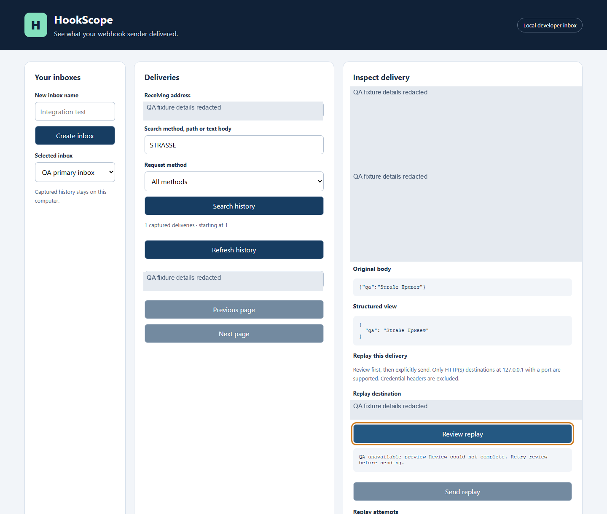
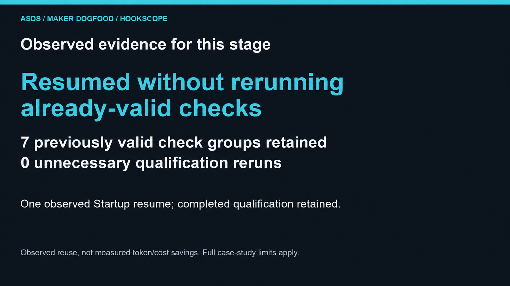
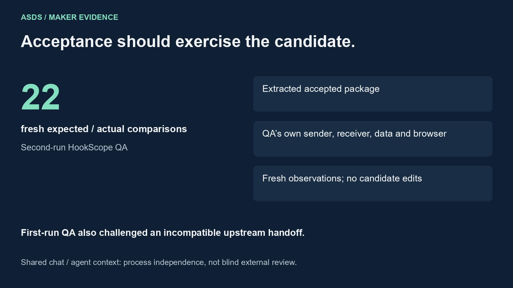
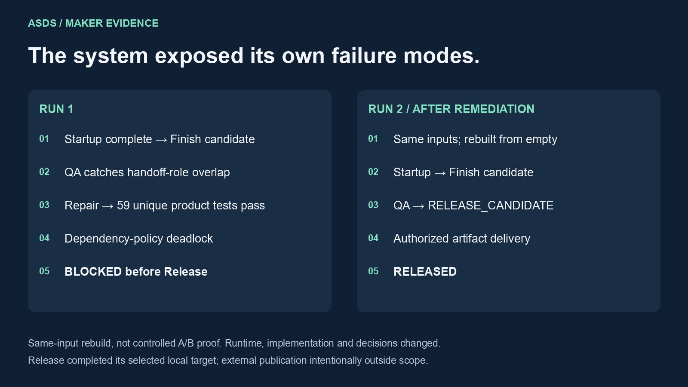

# ASDS case studies

## HookScope completed the full lifecycle and reached RELEASED

Startup → Finish → QA → Release → **RELEASED**.

The second HookScope build completed the ASDS lifecycle in **Codex on Windows**. Release delivered the exact accepted artifact to the explicitly authorized local artifact-delivery target, without rebuilding, with hash/read-back reconciliation. External publication was intentionally outside the approved scope.

HookScope is a local webhook inbox: receive deliveries, inspect their original contents, search history and deliberately replay them. This is a maker-run example, not customer proof or a controlled benchmark.

[Read the full case study](hookscope-case-study.md) · [Read the evidence digest and limitations](evidence/README.md)

*Actual product screenshot from a QA fixture. Fixture details are redacted. The unavailable-preview state shown here is an intentionally exercised error path; sending remains disabled.*

## Startup

### Resumed without rerunning already-valid checks

Startup completed the product brief and engineering foundation. During one disposition-approval resume, seven previously valid qualification groups were retained without repeating completed qualification. This is an observed reuse result, not a measured speed, token or cost improvement.

Outcome: **ENGINEERING_SYSTEM_COMPLETE**.

## Finish

### Closed the agreed scope and handed off a bounded candidate

Finish completed scoped functionality and verified the candidate. Seventeen product tests and five browser journeys passed before handoff. All 32 mandatory requirement-matrix rows mapped to 12 sealed gates. The terminal state was **PRODUCT_QA_CANDIDATE**, with acceptance left to QA.

Finish evidence does not itself award release acceptance.

## QA

### Fresh validation of the exact submitted candidate

QA exercised the extracted accepted package with its own sender, receiver, data and browser fixture. All 22 expected/actual comparisons passed, covering product behavior, error/recovery paths and applicable candidate acceptance requirements. QA did not edit the candidate or reuse Finish PASS as acceptance.

Outcome: **RELEASE_CANDIDATE**. Roles ran sequentially in shared chat/agent context: separate stage responsibilities and fresh observations, not blind external or organizationally independent review.

## Release

### Delivered the accepted artifact to the selected destination

Release executed the explicitly selected local artifact-delivery target successfully. It copied the accepted ZIP without rebuild or transformation and reconciled the delivered bytes by read-back and SHA-256.

Outcome: **RELEASED**. Public distribution was not attempted; it was outside the authorized target.

Selected final receipt facts from the retained second-run report:

- Completion timestamp: 2026-10-05T19:30:38.269687Z.
- Artifact size: 61,701 bytes.
- Accepted and delivered SHA-256: `c1042d74c45488e6e0240fe145025e61bc939ede33e09b19b4225468bdfb093c`.

These are report-backed receipt facts, not a publicly reproduced artifact verification. The accepted product ZIP is not included in this repository.

## What the first run exposed

The first run completed Startup and reached a Finish candidate. QA rejected overlapping candidate/product and acceptance-contract roles in the handoff. After repair, 59 unique product tests passed, but a mandatory development-dependency audit caused **QA_FAILED**. Finish could not establish a compatible clean-audit solution under the frozen contract and ended **BLOCKED before Release**.

The first and second runs use different units and scope. Their test counts do not establish a numerical improvement in quality.

## Methodology and limits

- One maker-run project, rebuilt from the same inputs after system remediation; not a controlled A/B study.
- The lifecycle run used Startup/Finish/QA/Release 1.1.0. Current Startup 1.1.1 includes a subsequent targeted reporting hotfix; no full lifecycle rerun of 1.1.1 is claimed.
- Product lifecycle: **RELEASED**. Supporting Recorder telemetry: incomplete because a QA checkpoint was missed and continuous recording could not finalize. That defect was subsequently fixed in Recorder 0.2.1 with targeted regression tests. The frozen recording was not reconstructed.
- Remote CI and optional trusted HTTPS success were not executed in the second run.
- No measured token, cost, comparable timing savings or ROI claims.
- Critic was not part of this lifecycle dogfood. No Critic execution or compatibility claim is inferred from these results.

## About the product line

ASDS means Agentic Software Delivery System. Current public product pages: [Startup](https://monisarek.gumroad.com/l/startup), [Finish](https://monisarek.gumroad.com/l/finish), [QA](https://monisarek.gumroad.com/l/qa), [Release](https://monisarek.gumroad.com/l/release), and the optional [Critic](https://monisarek.gumroad.com/l/critic).

All five individual products are published. A lifecycle bundle has been prepared locally; no live bundle offer is claimed. This repository contains case-study material; commercial skill packages are distributed separately.
